# 🔐 How to Install Burp Suite Pro on Linux (with Keygen) — Step-by-Step Guide


- Burp Suite Professional is a powerful tool for web application security testing. To install it on Kali Linux, follow the steps below:

## Prerequisites 📋
- In this guide, I’ll walk you through installing Burp Suite Pro on Linux with a keygen setup to activate it.

## 📥 Step 1: Download Burp Suite Pro
🔗 Official Burp Suite Pro Download Link
https://portswigger.net/burp/releases/professional-community-2025-5-6


## 🔐 Keygen File Setup
https://mega.nz/file/bZ82wbYL#jAJxD4zs2yIPPTgKuSPk6tDDU8f0MsvX_UMBtts98cY

alternate Link: 

https://mega.nz/file/jagiFYhL#Ag_2ZwNllmoCW3wov-LZKyqzkpGZYuxtmaZmK04N9Iw

<a href="./BurpLoaderKeygen.jar">BURPSUITEPRO FILE IN DIR </a>

---

## 🛠️ Step 2: Install Burp Suite Pro

- Open your terminal `login to root user `and follow the steps:

Navigate to the Downloads Directory:
```bash
cd Downloads
```
This allows the .sh script make a file executable in Linux.
```bash
chmod +x ./burpsuite_pro_linux_v2025_5_6.sh
```
Run the Installer Script:
```bash
./burpsuite_pro_linux_v2025_5_6.sh
```

- Then, follow the GUI installer prompts to complete the installation.

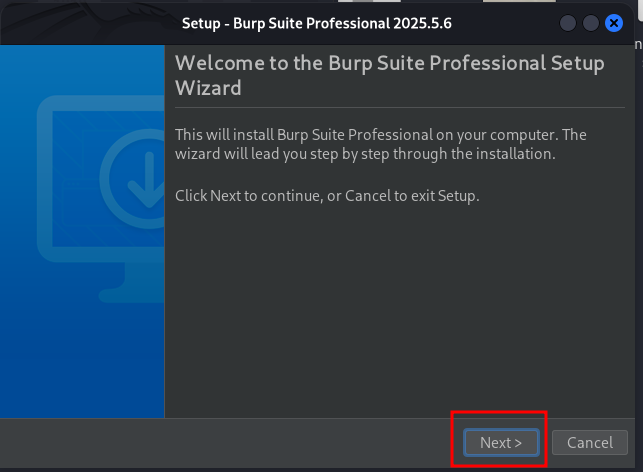

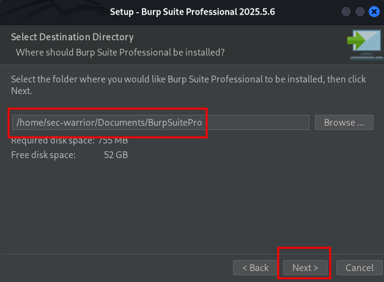

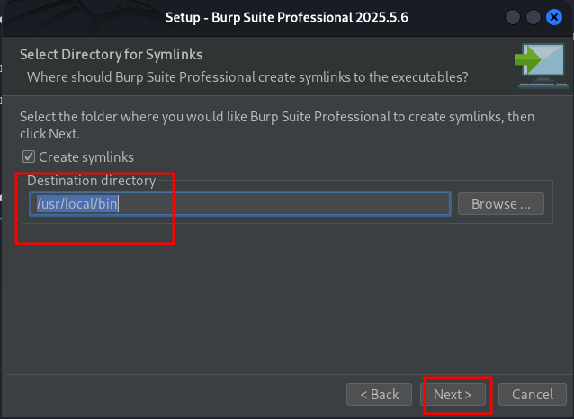

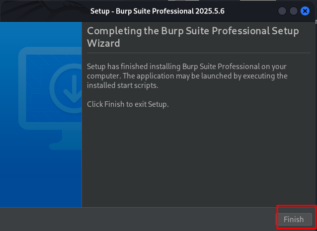


## 🧪 Step 3: Launch the Keygen
- Now it’s time to activate Burp Suite Pro using the Keygen.

```bash
mv -v BurpLoaderKeygen.jar ../Documents/BurpSuitePro/
```
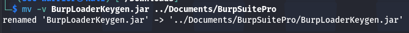

```bash
cd ../Documents/BurpSuitePro
```

```bash
java -jar BurpLoaderKeygen.jar
```
### Change license name:

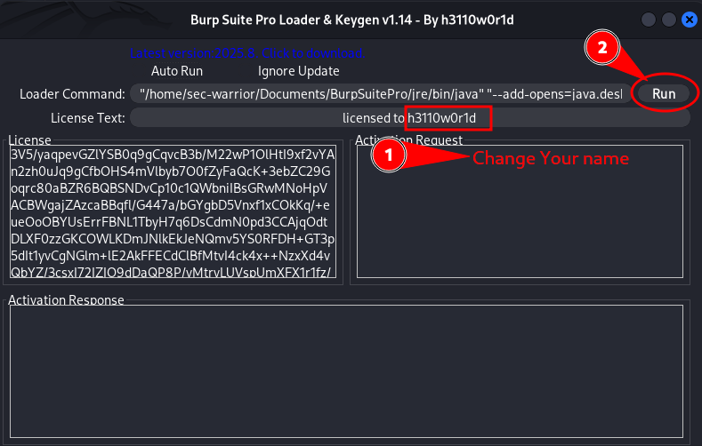

### This window will open:

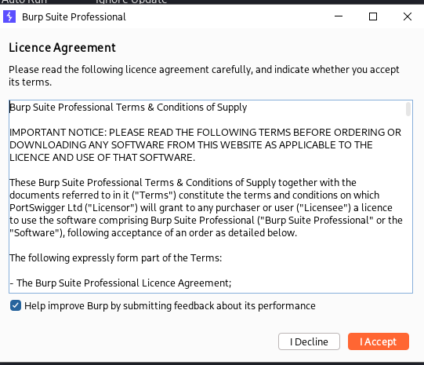


### Copy highlighted text from keygen:

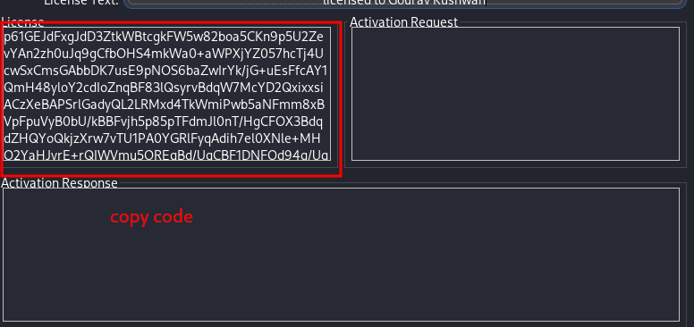

### paste license notepad

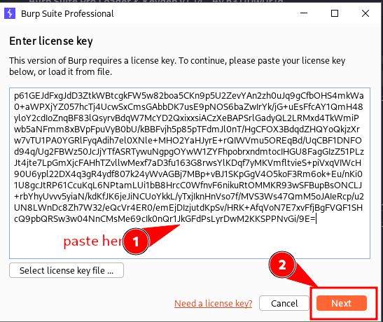

### Select Manual Activation:

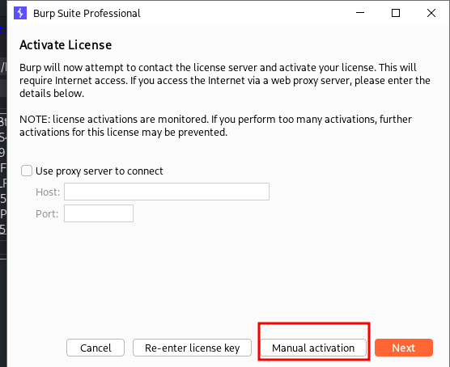


### Copy request:

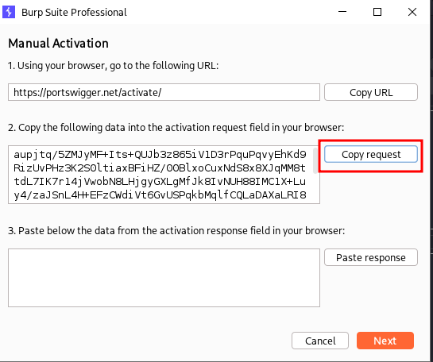

### Paste in Activation Request and Copy Response

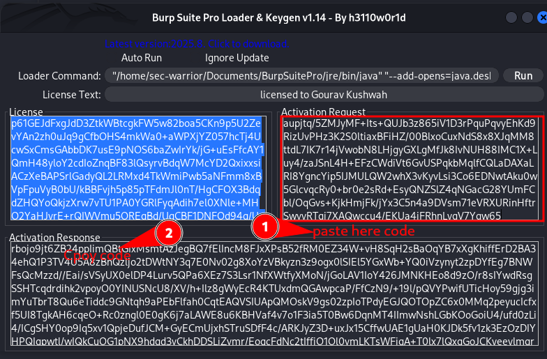

### Paste Response

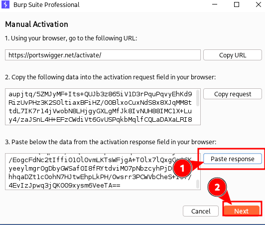

### Next > Click on Finish:

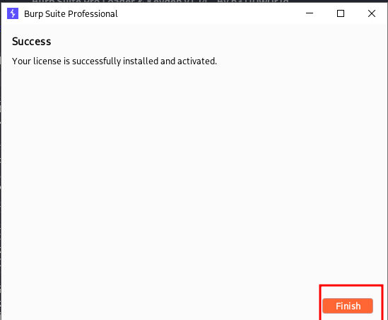

## ⚙️ Step 4: Final Setup
Take the loader command text from the Burp Suite Loader & Keygen, and paste it into the Burp Suite Pro directory:

### Copy the Loader Command:


### Replace /Documents/BurpSuitePro/BurpSuitePro file text with loader command:

```bash
nano /Documents/BurpSuitePro/BurpSuitePro
```
## Edit The Content

| Shortcut           | Action                    |
| ------------------ | ------------------------- |
| `Alt + \`          | Go to the top of the file |
| `Ctrl + 6`         | Set a mark                |
| `Alt + /`          | Select all text           |
| `Ctrl + Shift + K` | Delete selected text      |
| `Ctrl + Shift + V` | Paste copied line         |


### Save the file.

Now you can run Burp Suite Pro anytime using:

```bash
BurpSuitePro
```
🎉 You’re Done!
You’ve successfully installed and activated Burp Suite Pro on your Linux machine. It’s now ready for web vulnerability scanning, proxy interception, and other powerful security testing.