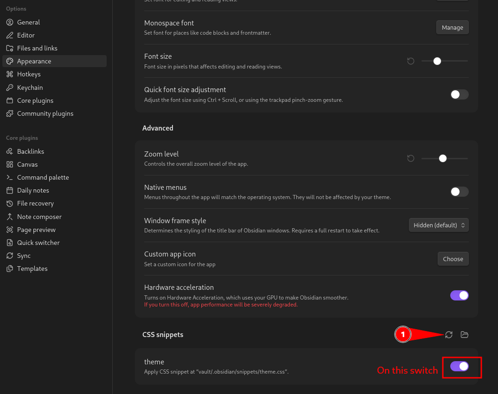
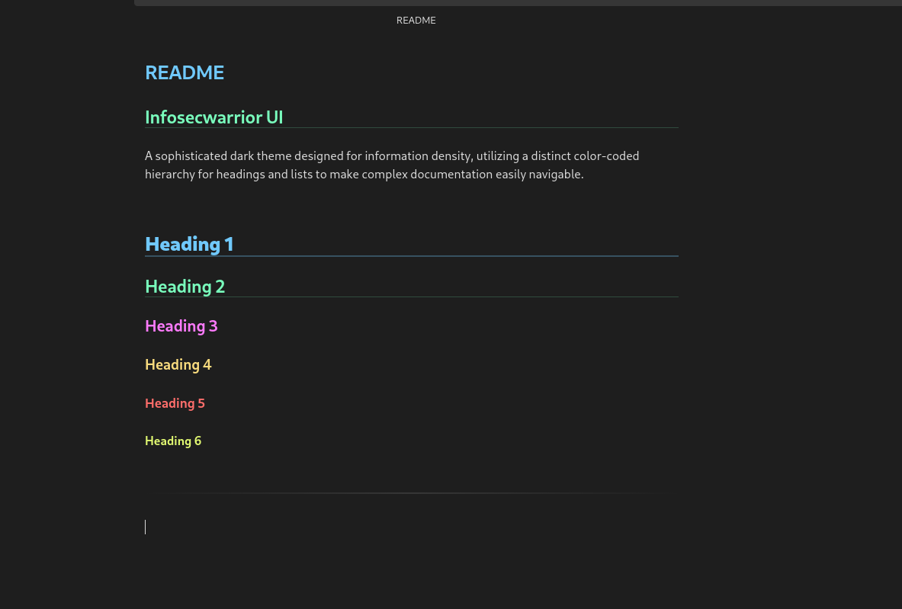

# 🎨 Infosecwarrior UI — **Obsidian** Theme Configuration Guide

A sophisticated dark theme for Obsidian designed for **information density**, featuring a clean hacker-style interface with **color-coded headings**, enhanced readability, and a modern cybersecurity aesthetic.

---

## 🌑 Infosecwarrior UI Theme

### ✨ Features

* Dark Cybersecurity Interface
* Color-coded Heading Hierarchy
* Clean Markdown Styling
* Enhanced Readability
* Minimal & Professional Design
* Perfect for Pentest Notes & Documentation

---

### 📦 Step 1 — Clone the Repository

Open terminal and clone the GitHub repository:

```bash
git clone https://github.com/infosecwarrior/infosecwarrior-ui
```

After cloning, move into the repository:

```bash
cd infosecwarrior-ui
```

---

### 📁 Step 2 — Open Obsidian Snippets Folder

#### Follow these steps carefully:

1. Open **Obsidian**
2. Navigate to:

    **Settings → Appearance**


3. Scroll to the bottom
4. Locate:
    **CSS Snippets**

5. Click the 📂 **Folder Icon**
   (**Open snippets folder**)

---

### 📄 Step 3 — Copy the Theme File

Inside the cloned repository you will find: **theme.css**

Copy this file into the Obsidian snippets folder.

Example:
```bash
cp theme.css ~/.obsidian/snippets/
```

---

### 🔄 Step 4 — Refresh CSS Snippets

Return to Obsidian.

Inside: 

Settings → Appearance → CSS Snippets

Click: **Reload snippets**


Then enable:

* `theme.css`



---

## ⚙️ Toggle the Core Setting

To properly configure the Infosecwarrior UI theme, disable the  
`Readable line length` setting in Obsidian.

## 🛠️ Steps

### 1️⃣ Open Obsidian Settings

Click the ⚙️ **Gear Icon** located in the bottom-left corner.

### 2️⃣ Navigate to Editor Settings

Go to:

**Settings → Editor**


### 3️⃣ Locate the Setting

Find the option named: 

- **Readable line length**

- Turn the toggle switch: **OFF**

---

### ✅ Result

After disabling this setting:

- Notes use full screen width
- Code blocks become easier to read
- Tables display properly
- Technical documentation looks cleaner
- Better information density for pentesting notes

---

### You can see like this:



---

## 📂 Recommended Folder Structure

```markdown
Vault/
└── .obsidian/
    └── snippets/
        └── theme.css
```
---